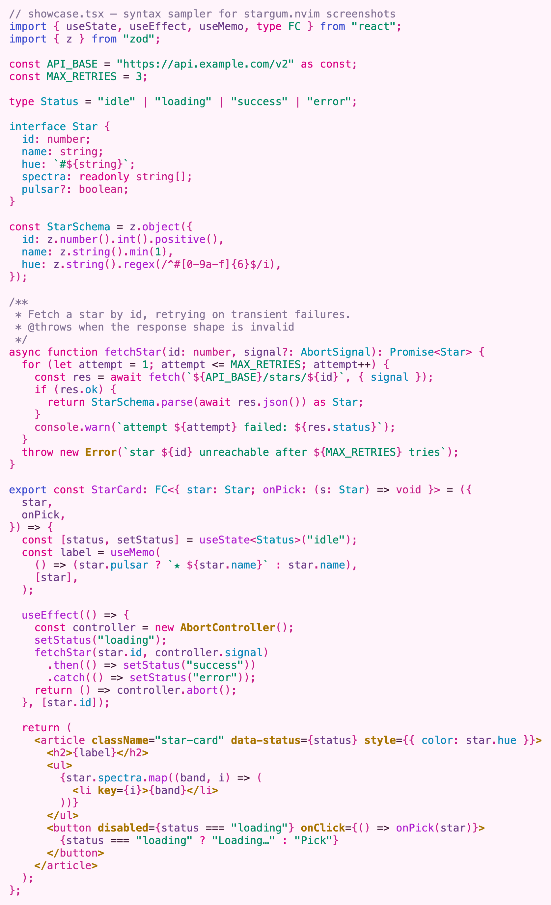
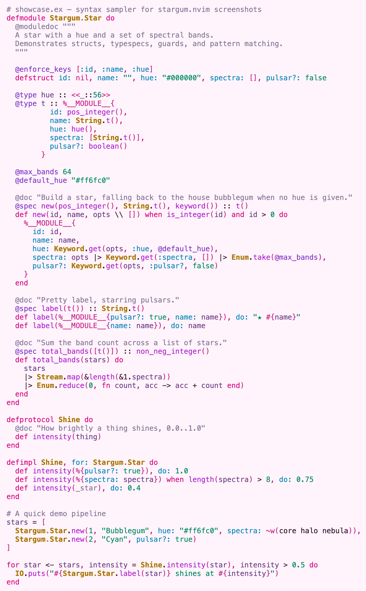

<p align="center">
  
</p>

A **bubblegum × space** colorscheme for Neovim, forked from the bundled
`elflord` and tuned for everyday TypeScript and Elixir work. Glaring nebula
pinks and electric cyans over a black deep-space background, with a signature
muted-gold border — full-tilt cybernetic neon.

## Showcase

`showcase.tsx` and `showcase.ex` (in [`samples/`](samples)) rendered with
treesitter highlighting. Each variant is a palette swap over the same shared
highlight set.

### ⭐️ `stargum`

| `showcase.tsx` | `showcase.ex` |
| --- | --- |
|  |  |

### 🌸 `stargum-light`

The daylit nebula — a near-white, faintly-pink background with deep, saturated
syntax. Same bubblegum × space identity, inverted.

| `showcase.tsx` | `showcase.ex` |
| --- | --- |
|  |  |

## Install

With `vim.pack`:

```lua
vim.pack.add({ "https://github.com/piacsek/stargum.nvim" })
vim.cmd.colorscheme("stargum")
```

With `lazy.nvim`:

```lua
{ "piacsek/stargum.nvim", config = function() vim.cmd.colorscheme("stargum") end }
```

The theme inherits from Neovim's bundled `elflord` (loaded via `:runtime
colors/elflord.vim`), so it requires no other dependencies — `elflord` ships
with Neovim.

## Make your terminal follow

stargum defines the full mirroring surface: `Normal`, `Cursor`, `Visual`, and
all 16 `g:terminal_color_*` ANSI slots tuned to the palette. Pair it with
[ghostty-mirror.nvim](https://github.com/piacsek/ghostty-mirror.nvim) and
`:colorscheme stargum` flips [Ghostty](https://ghostty.org) — and optionally your
tmux statusline — to match, instantly, across every open window. No theme files
to author: ghostty-mirror generates them from the palette.
