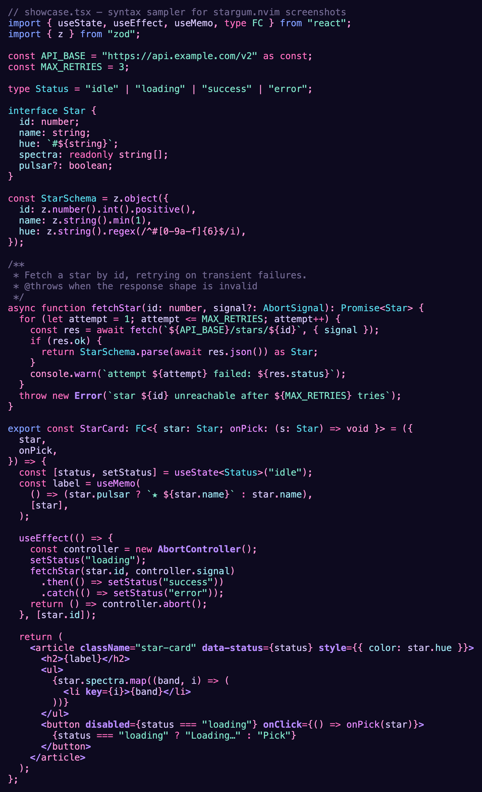
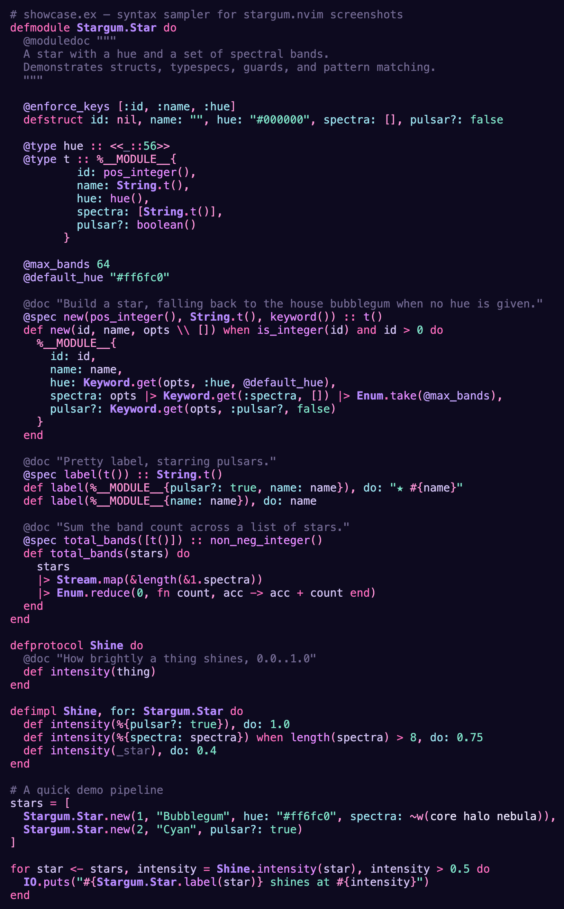

<p align="center">
  
</p>

A **bubblegum × space** colorscheme for Neovim, forked from the bundled
`zaibatsu` and tuned for everyday TypeScript and Elixir work. Nebula pinks and
electric cyans over a deep-space indigo background, with a signature muted-gold
border — cybernetic/neon energy without going full synthwave.

## Showcase

`showcase.tsx` and `showcase.ex` (in [`samples/`](samples)) rendered with
treesitter highlighting. More variants (including a light one) are on the way —
each is just a palette swap over the same shared highlight set.

### 🌸 `stargum`

| `showcase.tsx` | `showcase.ex` |
| --- | --- |
|  |  |

## The look

- **Violet-pink syntax core** anchored on the indigo background — bubblegum-pink
  keywords, orchid functions, violet modules — with **electric cyan as the cool
  relief** (types, strings, atoms / map keys) so the major lexical categories
  stay visually distinct.
- **Muted-gold borders.** Float borders, window separators, and WhichKey borders
  all read in a soft gold — the brand edge — instead of blending into the text.
- **Statusline** is a softer accent surface instead of `zaibatsu`'s bright white.
- **Floats** (LSP hover, diagnostics, plugin popups, Spectre, Harpoon, etc.) and
  the **completion popup** (`Pmenu` and friends) use a slightly-lighter-than-bg
  surface instead of white.
- **MatchParen** uses accent-on-surface instead of reverse video, so the cursor
  is visible inside matched parens.
- **Treesitter + LSP** highlights are tuned so colors stay stable when the LSP
  attaches (no flicker).
- **`terminal_color_0`** is lifted from the background so ANSI-black UI elements
  (lazygit borders inside `:terminal`, etc.) stay visible.

## Install

With `vim.pack`:

```lua
vim.pack.add({ "https://github.com/piacsek/stargum.nvim" })
vim.cmd.colorscheme("stargum")
```

With `lazy.nvim`:

```lua
{ "piacsek/stargum.nvim", config = function() vim.cmd.colorscheme("stargum") end }
```

The theme inherits from Neovim's bundled `zaibatsu` (loaded via `:runtime
colors/zaibatsu.vim`), so it requires no other dependencies — `zaibatsu` ships
with Neovim.

## Make your terminal follow

stargum defines the full mirroring surface: `Normal`, `Cursor`, `Visual`, and
all 16 `g:terminal_color_*` ANSI slots tuned to the palette. Pair it with
[ghostty-mirror.nvim](https://github.com/piacsek/ghostty-mirror.nvim) and
`:colorscheme stargum` flips [Ghostty](https://ghostty.org) — and optionally your
tmux statusline — to match, instantly, across every open window. No theme files
to author: ghostty-mirror generates them from the palette.

## Adding a variant

1. Create `lua/stargum/palettes/<name>.lua` returning a palette table (see
   `stargum.lua` for the semantic key contract; keep a gold-family `border`).
2. Create `colors/stargum-<name>.lua` with a single line:
   `require("stargum").load("<name>")`.

## Regenerating the gallery

```sh
samples/render.sh            # all variants (auto-discovered from palettes/)
samples/render.sh stargum    # only the named ones
```

Drives `nvim :TOhtml` → headless Google Chrome → ImageMagick. Requires nvim 0.12+
with the tsx/typescript/elixir treesitter parsers, plus Chrome and ImageMagick.
